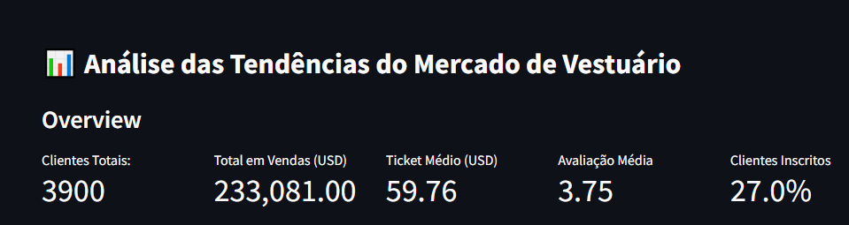
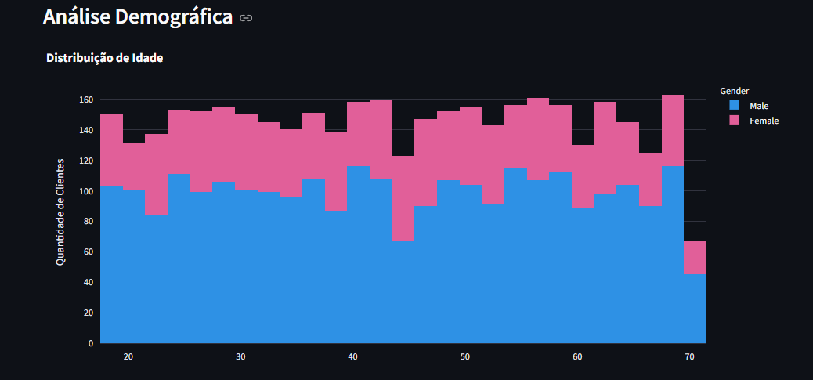
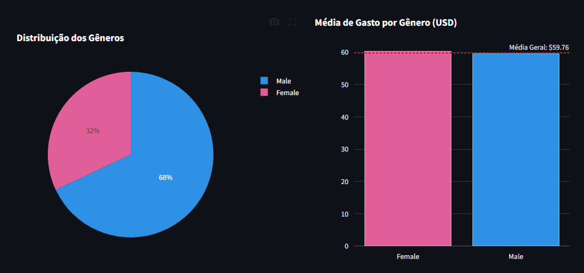
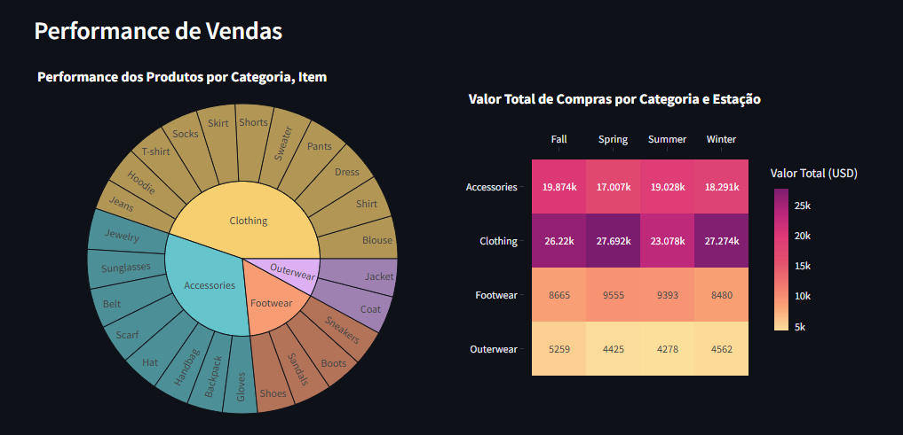

# 📊 Análise de Tendências de Compras de Clientes

Dashboard interativo para análise de comportamento de compras no mercado de vestuário.

## 🌐 Acesso Online
**Acesse o dashboard online:** [https://dash-vendas-matheus-morandi.streamlit.app/](https://dash-vendas-matheus-morandi.streamlit.app/) 

## 🚀 Funcionalidades Principais

### KPIs Principais
- Total de clientes únicos
- Valor total de vendas (USD)
- Média de valor de compra por cliente
- Taxa de inscrição dos clientes
- Avaliação média de reviews

### 📈 Visualizações Implementadas
- **Distribuição Demográfica**
  - Histograma de idade
  - Gráfico de pizza (proporção de gêneros)
  - Comparação de gasto médio por gênero (barras)
  - Top 10 estados por volume de vendas

- **Performance de Vendas**
  - Sunburst chart (categoria > item)
  - Ranking dos 10 itens mais vendidos

- **Comportamento do Cliente**
  - Donut chart (métodos de pagamento)
  - Valor médio por método de pagamento
  - Proporção de tipos de frete
  - Comparação vendas com/sem desconto

## 🛠️ Tecnologias Utilizadas

| Biblioteca           | Versão    |
|----------------------|-----------|
| pandas               | 2.2.3     |
| numpy                | 2.2.4     |
| streamlit            | 1.44.1    |
| streamlit_option_menu| 0.4.0     |
| plotly               | 6.0.1     |
| nbformat             | 4.2.0     |

## 📂 Dataset
[Customer Shopping Trends Dataset](https://www.kaggle.com/datasets/iamsouravbanerjee/customer-shopping-trends-dataset)  
Contém informações sobre:
- 3K+ transações
- 17 atributos incluindo dados demográficos, preferências de compra e métricas de transação

## 🖼️ Screenshots do Dashboard

## 📢 Conecte-se Comigo!
🔗 **GitHub**: [Matheus Morandi](https://github.com/MatheusMorandi)  
🔗 **LinkedIn**: [Matheus Morandi](https://www.linkedin.com/in/matheusmorandi/)  

Se você gostou deste projeto, deixe uma ⭐ no repositório! 😃